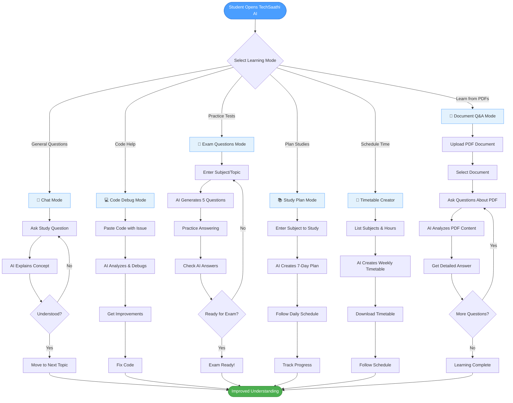
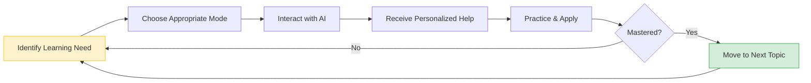
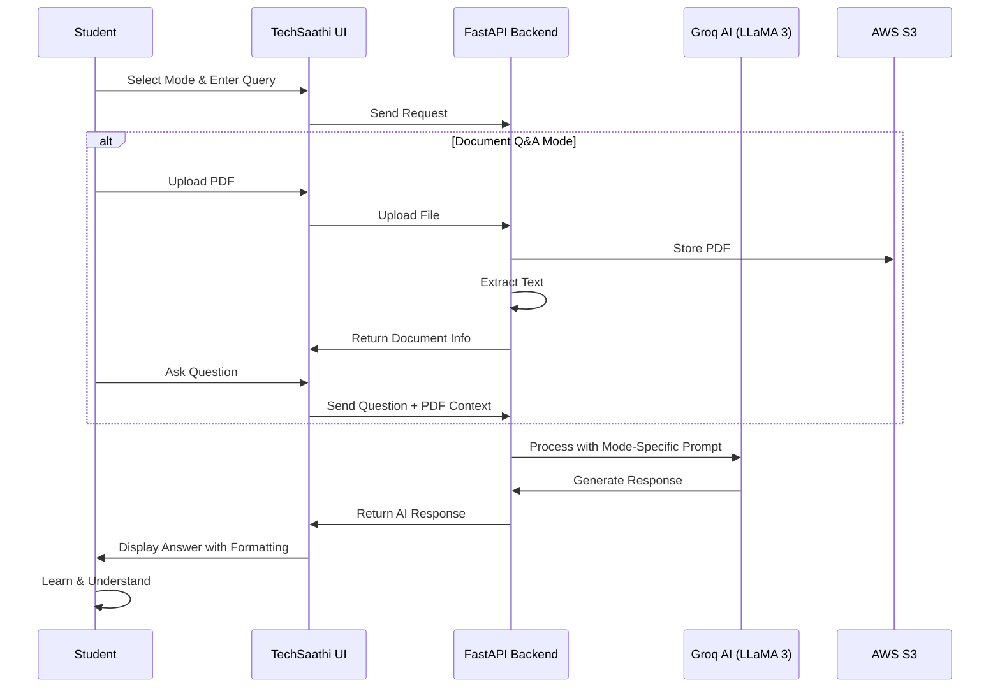

# TechSaathi AI - Student Learning Process Flow

## Student Learning Journey with TechSaathi AI

## Learning Process Breakdown

### 1. Chat Mode - Interactive Learning
**Student Journey:**
- Student has a question about any topic
- Asks TechSaathi AI in natural language
- AI provides clear, educational explanation
- Student can ask follow-up questions
- Iterative learning until concept is understood

**Use Case:** "Explain photosynthesis" → AI explains → "What about chlorophyll?" → AI elaborates

---

### 2. Code Debug Mode - Programming Help
**Student Journey:**
- Student encounters code error or bug
- Pastes code into TechSaathi AI
- AI analyzes syntax and logic
- AI suggests improvements and fixes
- Student learns debugging techniques

**Use Case:** Paste Python code with error → AI identifies bug → AI explains fix → Student learns

---

### 3. Exam Questions Mode - Test Preparation
**Student Journey:**
- Student wants to practice for exam
- Enters topic (e.g., "World War 2")
- AI generates 5 practice questions with answers
- Student attempts questions
- Reviews answers to assess knowledge
- Repeats until confident

**Use Case:** "Python loops" → 5 questions generated → Practice → Check answers → Exam ready

---

### 4. Study Plan Mode - Structured Learning
**Student Journey:**
- Student wants to learn a new subject
- Enters subject name
- AI creates detailed 7-day study plan
- Each day has topics, activities, practice
- Student follows plan systematically
- Tracks progress day by day

**Use Case:** "Machine Learning" → 7-day plan → Day 1: Basics → Day 2: Algorithms → ...

---

### 5. Timetable Creator - Time Management
**Student Journey:**
- Student has multiple subjects to study
- Lists subjects and available hours
- AI creates weekly timetable
- Balanced distribution across days
- Includes breaks and rest periods
- Downloads timetable for reference

**Use Case:** "Math, Physics, Chemistry - 6 hours daily" → Weekly schedule → Download → Follow

---

### 6. Document Q&A Mode - PDF Learning
**Student Journey:**
- Student has study material in PDF
- Uploads PDF to TechSaathi AI
- Selects document from sidebar
- Asks questions about content
- AI analyzes PDF and answers
- Deep understanding of material

**Use Case:** Upload textbook chapter → "Explain theorem 5" → AI reads PDF → Detailed explanation

---

## Overall Learning Cycle

## Key Benefits for Students

1. **Personalized Learning** - AI adapts to student's questions and pace
2. **Multi-Modal Support** - Different modes for different learning needs
3. **24/7 Availability** - Learn anytime, anywhere
4. **Instant Feedback** - No waiting for teachers or tutors
5. **Document Analysis** - Learn from existing study materials
6. **Structured Planning** - Organized approach to learning
7. **Practice & Assessment** - Test knowledge with generated questions

---

## Technology-Enabled Learning Flow

---

*This diagram illustrates how TechSaathi AI supports the complete student learning journey through AI-powered assistance.*
